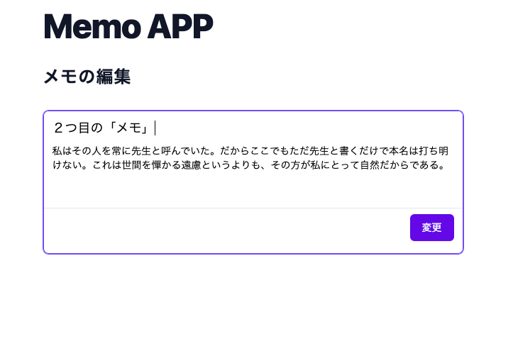

# Sinatra Memo App

Simple note taking application built by Sinatra

## Installation

Make sure you already installed [rbenv](https://github.com/rbenv/rbenv)

```bash
rbenv install 3.0.3

gem install bundler

bundle install

bundle exec ruby main.rb
```

You can see Memo application running on http://localhost:4567

## Screenshots

### /

#### Empty Top Page


#### Top Page with data


### /new

#### New memo


### /:id

#### Show memo


### /:id/edit

#### Edit memo



### /reset

#### Delete all memos


### /not_found

#### If page not found


